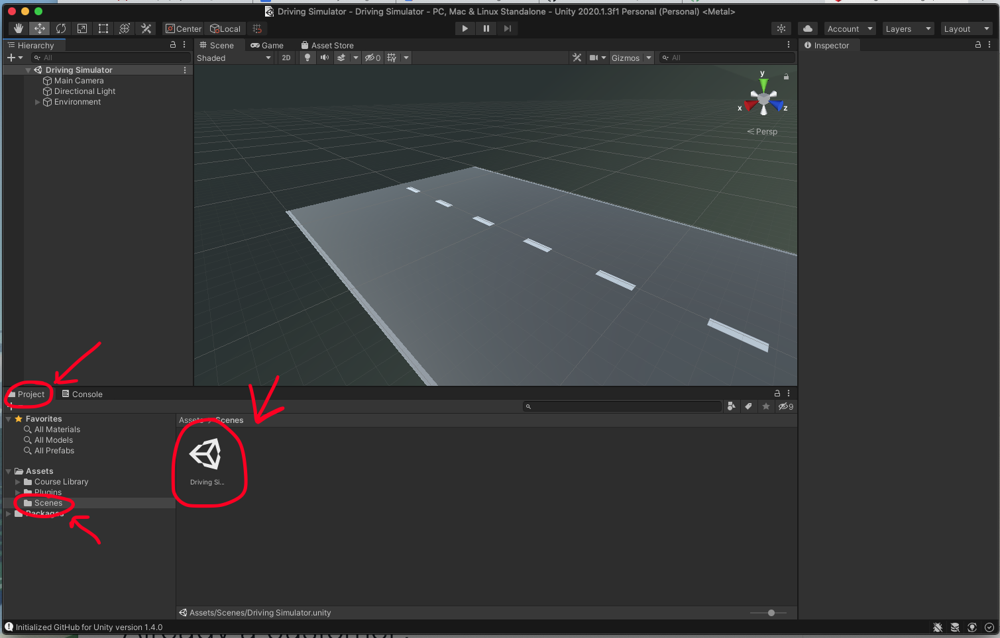

# Learning the Basics of Unity

## Overview

In this project, you will first learn the basics of Unity by completing a
Driving Simulator. Then, you will apply what you learned while creating that
driving simulator to fix and implement a Flying Simulator.

* [Setup your repository](#setup-your-repository)
  * [Sign up for the project](#sign-up-for-project)
  * [Setup Git LFS](#setup-git-lfs)
* [Setting up Unity](#setting-up-unity)
  * [Create a Unity Account](#create-a-unity-account)
  * [Download Unity Hub](#download-unity-hub)
  * [Create a License](#login-to-unity-hub-and-create-a-license)
  * [Install Unity](#download-and-install-unity)
  * [Add Unity to Unity Hub](#add-unity-install-to-unity-hub)
* [Driving Simulator](#driving-simulator)
  * [Import Driving Simulator](#import-driving-simulator-project)
  * [Configure VS Code for Unity](#configure-vs-code-for-unity)
  * [Ed Puzzles](#ed-puzzles)
* [Airplane Challenge](#airplane-challenge)
  * [Known Bugs](#known-bugs)
  * [Hints](#hints)
  * [Adding Extra Features](#adding-extra-features)
* [Milestones](#milestones)
  * [Milestone 1](#milestone-1)
  * [Milestone 2](#milestone-2)
  * [Milestone 3](#milestone-3)
* [Grading](#grading)
  * [Computational Thinking](#computational-thinking)
  * [Computing, Programming and Practice](#computing-programming-and-practice)
  * [Skills of a Student](#skills-of-a-student)
* [Getting Help](#getting-help)

## Setup your repository

### Sign up for Project

Sign up for the project repository here:
[https://classroom.github.com/a/7-x3M_UO](https://classroom.github.com/a/7-x3M_UO)

The Game Dev Piazza is here: [piazza.com/chadwickschool.org/fall2020/bdf3](piazza.com/chadwickschool.org/fall2020/bdf3)

After your repository has initialized it, clone it to your computer. I recommend
putting it in your `ap-csp` directory.

After you've cloned your repository, run the `setup.sh` script in the root of
that repository to initialize it's configuration.

Upon completion it should display a message similar to this one:

```
######################################################
# SETUP IS COMPLETE. YOU SHOULD NOW CREATE A         #
# `develop` BRANCH BY RUNNING THE FOLLOWING COMMAND: #
#                                                    #
# git checkout -b develop                            #
#                                                    #
# THEN PUSH THAT BRANCH TO GITHUB BY RUNNING THE     #
# FOLLOWING COMMAND:                                 #
#                                                    #
# git push -u origin develop                         #
#                                                    #
# AFTER PUSHING, OPEN A PULL REQUEST FROM YOUR       #
# `develop`  BRANCH TO THE `main` BRANCH BY VISITING #
# THIS REPO ON GITHUB, CLICKING `Pull Requests`      #
# THEN `New pull request`. THE BASE BRANCH SHOULD BE #
# `main` and THE COMPARE BRANCH SHOULD BE `develop`. #
#                                                    #
# FINALLY, ADD YOUR INSTRUCTOR AS A REVIEWER ON      #
# GITHUB. THIS IS HOW YOUR INSTRUCTOR WILL SEE YOUR  #
# WORK.                                              #
######################################################
```

Follow the directions to create a `develop` branch as well as pushing your
`develop` branch to Github.

Finally, create a pull request from your `develop` branch to the `main` branch
and assign `jcollard` as a reviewer.


### Setup Git LFS

For all future projects, we will be using `git-lfs`. On Mac, the easiest way to
install it is running `brew install git-lfs` in your terminal. If you are not on
mac, you will need to install it for your system: https://git-lfs.github.com/

You will know Git LFS is working when you run `git-lfs` in your repository and
get the following message:

```
$ git lfs install
Updated git hooks.
Git LFS initialized.
```

## Setting up Unity

### Create a Unity Account

To use Unity, you are required to have a developer license. The basic developer
license is free and can be acquired by simply creating an account on Unity's
official website: [https://unity.com/](https://unity.com/)

From this page, click the icon in the top right of the page and then click the
`Create a Unity ID` link (or if you already have a Unity ID click Sign in).


### Download Unity Hub

After you have your account, you will need to download Unity Hub:
[https://unity3d.com/get-unity/download](https://unity3d.com/get-unity/download).

You should click the `Download Unity Hub` button here, not the `Choose your
Unity + download` button.


### Login to Unity Hub and Create a License

Now that you have Unity Hub installed, you must login and register a license.
Launch Unity Hub, click the icon in the top right and select Sign in.


After you've logged in, you can now click on the same icon and select Manage
license.


From this page, select `Activate New License`, select `Unity Personal`, `I don't
use Unity in a professional capacity.`, then click `Done`.


### Download and Install Unity

Next you need to download the `Unity Installer` for `Unity 2020.x` for your
operating system from the Unity download archive:
[https://unity3d.com/get-unity/download/archive](https://unity3d.com/get-unity/download/archive)


This will download the `Unity Download Assistant`. If you're prompted to select
components to install, you only need install `Unity 2020.1.xyz`. Note, that the
`xyz` here will be different for you when you get to this point.

You do not need to select any other components. However, you may wish to select
Linux, Mac, WebGL, and Windows Build support if you wish to export as an
executable. Note: You may install these components at a later time if you wish.

### Add Unity Install to Unity Hub

Next, you will need to add the install to Unity Hub. In Unity Hub, select
`Installs` from the left menu. Then, click the `Locate` button. Navigate to the
version of Unity that was installed and click `Select Editor`. You should now
see the version of Unity you installed listed in Unity Hub.


After you've located your installed Unity


Now you're ready to begin using Unity.

## Driving Simulator

### Import Driving Simulator Project

Launch Unity Hub and select Projects from the left menu. Then, click `ADD` to
locate your repository.


Locate your repository and select the `Driving Simulator` directory. Then, click
`Open`.


From the projects page, click the `Driving Simulator` project to launch Unity.
In the `Project` explorer, select `Assets` > `Scenes` and then double click the
`Driving Simulator` scene. This will bring you to the main project.



### Configure VS Code for Unity

For consistency with class and to allow your instructor to better help you, you
should configure Unity to use VS Code.

From the `Unity` menu, select `Preferences`


In `Preferences` select `External Tools`. Then, set `External Script Editor` to
be `Visual Studio Code`.


Next, you will need to install the C# extension for VSCode. You can find it
here:
[https://marketplace.visualstudio.com/items?itemName=ms-dotnettools.csharp](https://marketplace.visualstudio.com/items?itemName=ms-dotnettools.csharp)

You will also need to install the .NET Core SDK which can be found here:
[https://dotnet.microsoft.com/download](https://dotnet.microsoft.com/download)

On Windows, you will need to install the .NET Framework Developer Pack which can
be found here:
[https://dotnet.microsoft.com/download/dotnet-framework/net472](https://dotnet.microsoft.com/download/dotnet-framework/net472)

On Mac, you will need to install Mono by running `brew install mono`. 

After all of these steps, **YOU MUST RESTART YOUR COMPUTER** for them to take
effect.

The last step will only work after you have restarted your computer.

Open VSCode and Press `F1` to bring up the search menu. Search for `Open
Settings (JSON)`


Then add the following lines just above the last curly brace:
```json
    "omnisharp.useGlobalMono": "always",
    "csharp.referencesCodeLens.enabled": false
```

Your completed file will look something like this:
```json
{
    "workbench.colorTheme": "Visual Studio 2019 Dark",
    "window.zoomLevel": 0,
    "editor.suggestSelection": "first",
    "vsintellicode.modify.editor.suggestSelection": "automaticallyOverrodeDefaultValue",
    "omnisharp.useGlobalMono": "always",
    "csharp.referencesCodeLens.enabled": false
}
```

Save this file and restart VSCode. You're now ready to begin working on the
Driving Simulator.

### Ed Puzzles

The following videos will take you through getting a basic driving simulator up
and running. Note, these videos use Visual Studio (not Visual Studio Code). This
means the editors won't match up exactly. However, the content should still
work. Work your way through each Ed Puzzle and create a git commit after each
video with your completed work.

#### Part 1: Getting Started

This Ed Puzzle assumes you are not using GitHub, you should skip to 3:30

[https://edpuzzle.com/media/5f4ded280e100e3f413fbfe8](https://edpuzzle.com/media/5f4ded280e100e3f413fbfe8)

#### Part 2: PlayerController Script

[https://edpuzzle.com/media/5f56f3d44f054a3f0960c51d](https://edpuzzle.com/media/5f56f3d44f054a3f0960c51d)

#### Part 3: Camera Follower

[https://edpuzzle.com/media/5f587149ebca683f27fd9aec](https://edpuzzle.com/media/5f587149ebca683f27fd9aec)

#### Part 4: Player Controls

[https://edpuzzle.com/media/5f587138ac894d3f8d36af09](https://edpuzzle.com/media/5f587138ac894d3f8d36af09)

#### Part 5: Rigid Bodies

[https://edpuzzle.com/media/5f5871446ea1c03fa7092d69](https://edpuzzle.com/media/5f5871446ea1c03fa7092d69)

## Airplane Challenge

In addition to the `Driving Simulator` Unity project, there is also an `Airplane
Challenege` Unity project. Add this to Unity Hub the same way you added the
`Driving Simulator`.

This project is full of bugs that you must find and fix using what you learned
while implementing the `Driving Simulator`.

Within the project, there is a directory called `Example Video` which contains a
movie showing what the `Airplane Challenge` should look like to receive a score
of Proficient in the Computional Thinking category.

### Known Bugs

* The plane is going backward rather than forward
* The planes default speed is *WAAAY* too fast
* The plane rotates up automatically, make the plane rotate when the player
  presses up / down
* The plane camera does not follow the plane
* The propeller is not spinning (You may need to search the web to find ways to
  accomplish this.

### Hints

* Make the plane go forward
  - Hint: Vector3.back makes an object move backwards, Vector3.forward makes it
    go forwards
* Slow the plane down to a manageable speed
  - Hint: If you multiply a value by Time.deltaTime, it will change it from
    1x/frame to 1x/second
* Make the plane tilt only if the user presses the up/down arrows
  - Hint: In PlaneController.cs, in Update(), the verticalInput value is
    assigned, but it’s never actually used in the Rotate() call
* Reposition it so it’s beside the plane
  - Hint: For the camera’s position, try X=30, Y=0, Z=10 and for the camera’s
    rotation, try X=0, Y=-90, Z=0
* Make the camera follow the plane
  - Hint: In FollowPlane.cs, neither the plane nor offset variables are assigned
    a value - assign the plane variable in the camera’s inspector and assign the
    offset = new Vector3(30, 0, 10) in the code
* Bonus - Make the camera follow the plane
  - Hint: There is a “Propeller” child object of the plane - you should create a
    new “SpinPropellerX.cs” script and make it rotate every frame around the Z
    axis.

### Adding Extra Features

To receive a score of Advanced in the Computational Thinking category, you must
implement a feature of your choosing. This could be to add sound, add additional
obstacles, create additional player controls such as a barrel roll or firing
bullets. Be sure to ask if your feature meets the critera of "Advanced" before
implementing it. This should be done on Piazza.

## Milestones

### Milestone 1

Complete Part 1

Due Date: Monday October 26th @ 8AM

You must demonstrate that you've installed Unity, configured VSCode, cloned your
repository, created a script and committed it to your repository.

All code that you would like to count toward your evaluation should be part of a
`tag` on in your repository called `milestone-1`. This can be created by running
`git tag milestone-1`. Then push your tag to your repository by running `git push -u origin milestone-1`. The date of this tag creation will be used to determine when your work was submitted.


### Milestone 2

Completed Parts 2 - 5

Due Date: Thursday October 28th @ 8AM

You must complete all 5 Ed Puzzles demonstrating basic knowledge of using Unity.
Your source code should be committed and pushed to your repository by this time.

All code that you would like to count toward your evaluation should be part of a
`tag` on in your repository called `milestone-2`. This can be created by running
`git tag milestone-2`. Then push your tag to your repository by running `git push -u origin milestone-2`. The date of this tag creation will be used to determine when your work was submitted.

### Milestone 3

Completed the Airplane Challenge

Due Date: Monday November 2nd @ 8AM

Your completed Challenge is due at this time. All code that you would like to
count toward your evaluation should be part of a `tag` on in your repository
called `milestone-3`. This can be created by running `git tag milestone-3`. Then push your tag to your repository by running `git push -u origin milestone-2`. The date of this tag creation will be used to determine when your work was submitted.
submitted. 

## Grading

#### Computational Thinking

In this assignment, you must demonstrate a basic understanding of C# and Unity
as well as the ability to apply what you've learned during the Driving Simulator
videos to the Flying Simulator Challenge. To receive Advanced marks, student
must go above and beyond the Challenge by adding in their own personal
customizations.

| Advanced                                                                                                                                                                                                           | Proficient                                                | Basic                                          | Below Basic                                     |
|--------------------------------------------------------------------------------------------------------------------------------------------------------------------------------------------------------------------|-----------------------------------------------------------|------------------------------------------------|-------------------------------------------------|
| Student customizes the air plane challenge by adding in a feature of their choice. This feature should be described in detail in your README.md. Examples: sound, additional unique obstacles, or special controls | The plane moves forward at a constant rate                | Vehicle can be controlled using the arrow keys | Student does not complete the Driving Simulator |
|                                                                                                                                                                                                                    | The up/down arrows tilt the nose of the plane up and down | Camera follows Vehicle                         |                                                 |
|                                                                                                                                                                                                                    | The camera follows along beside the plane as it flies     | Student uses Rigid Bodies to create obstacles  |                                                 |


### Computing, Programming and Practice

Demonstrate how you tested your assignment, write comments, and provide well
written commits.

| Advanced                                                                                                                                       | Proficient                                                                                       | Basic                                                                                                                   | Below Basic                                                                    |
|------------------------------------------------------------------------------------------------------------------------------------------------|--------------------------------------------------------------------------------------------------|-------------------------------------------------------------------------------------------------------------------------|--------------------------------------------------------------------------------|
| Student provides Screenshots / Videos of their final solutions and adds them to their README.md                                                | Student created README.md file stating how they tested their solutions and any known bugs.       | Student created a README.md for their solutions                                                                         | Student did not complete a README.md                                           |
| Student comments all methods describing all inputs and side effects as well as comments inside their methods describing tricky implementations | Student wrote comments inside their methods describing the tricky parts of their implementation. | Student wrote some comments                                                                                             | Student did not write comments                                                 |
| Student comments all member variables describing their use                                                                                     | Student comments most of their member variables                                                  | Student comments some of their member variables. Comments may not be particularly useful or contains grammatical errors | Student did not write comments                                                 |
| All of the students commits follow the commit message template.                                                                                | Most of the students commits follow the commit message template.                                 | Some of the students commits follow the commit message template                                                         | Few or none of the students commit messages follow the commit message template |

### Skills of a Student

Your skills of a student covers your StudentLog repository, your in class time
management, meeting deadlines, asking for help when needed, and helping others
when able.

| Advanced                                                                           | Proficient                   | Basic                                                    | Below Basic                                          |
|------------------------------------------------------------------------------------|------------------------------|----------------------------------------------------------|------------------------------------------------------|
| Manages time well in class, stays focused on work  at hand at all times            | Focuses on work in class     | Focuses at times, can get distracted                     | Uses class time poorly, is frequently distracted     |
| Meets all deadlines, on or ahead of schedule                                       | Meets deadlines              | Delivers close to deadline, may be late  by a day or two | Delivers work late or not at all                     |
| Advocates for self, seeks clarification when needed  and volunteers to help others | Seeks assistance when needed | Needs prompting to seek assistance                       | Does not seek assistance or ask for help when needed |

## Getting Help

All questions should be posted to the class Piazza board. You are also
encouraged to help other students who post on Piazza. When you post your
question, be sure to include as many details as possible for reproducing the
issue you're having.

Questions you should answer when asking a question include:

1. What are you trying to do?
2. What did you try?
3. What was the result?

Work hard to make sure the person trying to answer your question can reproduce
your error. Share your files so others can run exactly what you're running.

Also, include screenshot!

Formulating good questions is a good life long skill. You should try asking your
question on Piazza before seeking out synchronous time with Mx. Collard.
However, if you would like to meet to discuss synchronously, first, look at [Mx.
Collard's Calendar](http://tinyurl.com/mx-collard-calendar), then send them an
email with at least two proposed times you would like to meet.